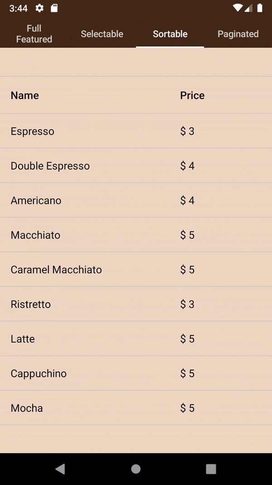
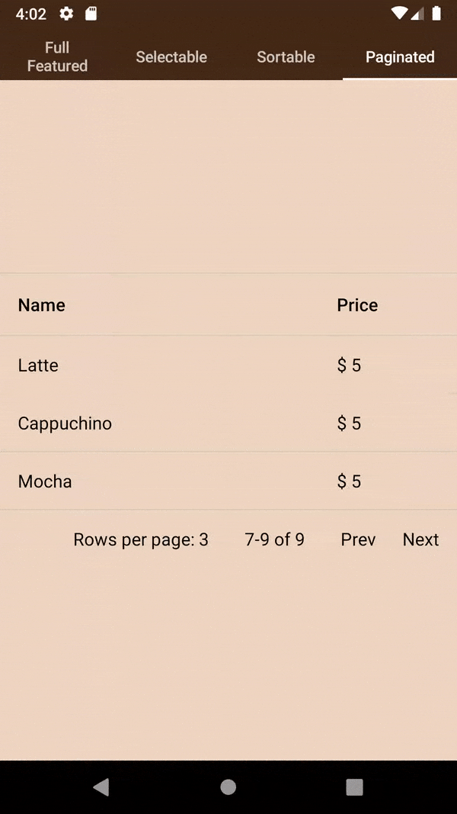
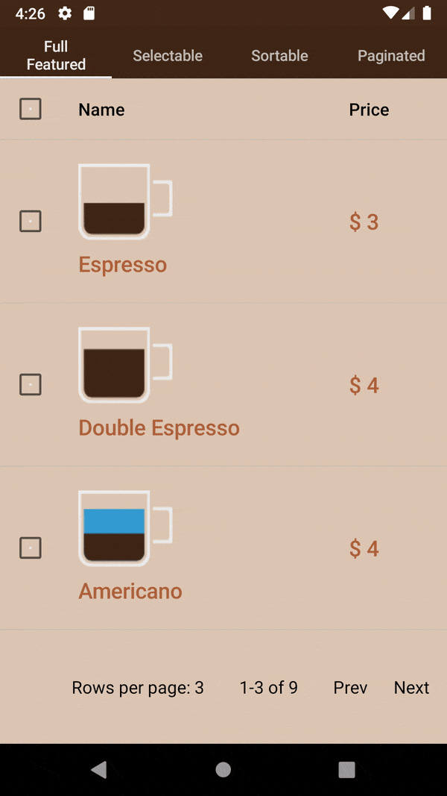

# ComposeDataTable

DataTable View using Jetpack Compose

### Read
[About Jetpack Compose Data Table on Medium](https://proandroiddev.com/jetpack-compose-data-tables-33a247f59fd5?source=friends_link&sk=991c7de1dc8034e68af2667a6d1ebce4)

### Simple Table

     

 

### Sortable Table

     
     
     
     
 

### Selectable Table

     
     

     
     
 

### Paginated Table

     
     
     
 

### Full Featured and Customized Table

                    
     
    

[Follow me on Twitter](https://twitter.com/Linminphyoe1)

### Credits
Coffee icons : https://www.freepik.com/free-photos-vectors/coffee.

     
